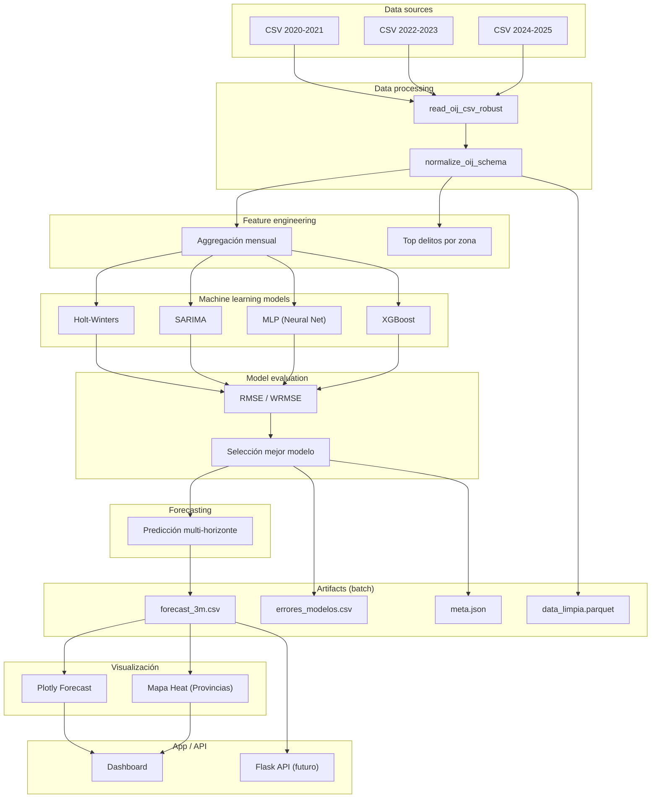

# Proyecto_ML

Proyecto de Machine Learning (curso Paradigmas): modelos de series temporales sobre datos de delitos (OIJ), con app Flask y persistencia SQLite.

## Estructura

- `ML1.py` — Entrenamiento (SARIMA, Holt-Winters, MLP, XGBoost como modelo adicional) y escritura de `artifacts/<run_id>/` (incluye `forecast_3m.csv` / `forecast_3m_int.csv` y `forecast_60m.csv` / `forecast_60m_int.csv`, 60 meses). Los HTML de Plotly se guardan con `auto_open=False` para no lanzar el navegador al ejecutar el pipeline desde la app.
- `db.py` — SQLite `data.db`, tabla `delitos` (`get_connection`, `insert_dataframe`, `get_all_data`).
- `data/` — CSV originales (y destino de uploads desde la web).
- `artifacts/` — Resultados por ejecución (forecast, tablas, HTML).
- `web/` — Flask (`main.py`, templates).

## Flujo de datos

1. **Subida desde Flask**: el CSV se guarda en `data/` y se indexa en SQLite (intento con pandas; si no encaja el esquema OIJ, se usa el parser robusto en `db.py`).
2. **ML1.py** — fuente según argumentos (o desde la web en `/run`):
   - `python ML1.py auto` — SQLite si hay datos; si no, todos los `data/*.csv`.
   - `python ML1.py db` — solo SQLite (falla con mensaje claro si está vacía).
   - `python ML1.py csv nombre.csv` — solo ese archivo en `data/`.
   - `python ML1.py all_csv` — **siempre** todos los `data/*.csv` concatenados (ignora SQLite). Es el modo que usa la web al elegir «Todos los CSV» en `/run`.
3. **Duplicados**: no se insertan filas con el mismo `row_hash` (contenido lógico del registro).

## Cómo probar

1. **Base SQLite + pipeline** (desde la raíz `Proyecto_ML/`):

   ```bash
   python -c "import db; print(db.get_all_data().shape)"
   python ML1.py
   ```

   Con datos en `delitos`, el script debe imprimir `Datos cargados desde SQLite`. Borrar o vaciar la tabla (o eliminar `data.db`) para forzar el modo CSV.

2. **Flask**:

   ```bash
   cd web
   python main.py
   ```

   Estilos globales tipo tarjetas (referencia Microsoft Teams / Fluent): `web/static/css/teams-ui.css`, enlazado desde `templates/base.html`. Capa de producto (`static/css/product-shell.css`): barra con **Pronóstico** (`/forecast`), hubs «Explorar análisis» / «Ver visualizaciones» (`static/js/analysis-hub.js`) que abren un diálogo de tarjetas y cargan cada módulo en un **panel lateral** vía `GET /partial/<slug>` (fragmentos en `templates/partials/`, sin sustituir las rutas `/types`, `/charts`, etc.). En «Ver visualizaciones», la tarjeta **Relaciones y mapas de calor** solo se muestra si el último run tiene al menos un HTML con `heatmap` en la sección `relations` del payload (`has_relations_heatmap` vía `context_processor` en `main.py`). En el **panel lateral** (`GET /partial/...`) se envía `hub_panel=True`: los mismos partials ocultan descargas, tablas técnicas colapsables, listas largas de gráficos HTML y similares; las **páginas completas** (`/results`, `/types`, `/dashboard`, etc.) muestran el detalle técnico completo. Tema oscuro por defecto. En `/forecast` se prioriza `forecast_3m` con gráfico **Chart.js** (histórico + pronóstico leyendo CSV por `fetch` desde `/artifacts/…`, zoom/pan vía [chartjs-plugin-zoom](https://www.chartjs.org/chartjs-plugin-zoom/latest/)); la página `/forecast` muestra solo el gráfico y la lista mes→valor; tablas, descargas y banda de evaluación (`forecast_band.html`) se orientan al hub **Ver visualizaciones**.

   Rutas: `/` (**Carga de datos**): subida de CSV y lista mínima (sin elegir “archivo activo”); botón **Procesar** → `/run`. CRUD vía `fetch`: **`GET /api/datasets`**, **`POST /api/datasets/rename`**, **`POST /api/datasets/delete`**, **`POST /api/datasets/upload`** (`web/static/js/datasets_crud.js`). La API **`POST /api/datasets/active`** sigue existiendo por compatibilidad; el flujo principal no depende de la selección manual. **`GET /api/datasets/preview`** sigue expuesta en la API para otras vistas. Subida clásica en `<noscript>` si no hay JS. **`/run`**: **Procesar** llama **`POST /api/run/execute`** con `{"merge_all": true}`: en `web/main.py` se concatenan todos los CSV en `data/` (excepto `merged_dataset.csv`) en **`data/merged_dataset.csv`**, se detecta la columna de fecha conocida y se ordena (`fecha` / `date` / `timestamp`, sin distinguir mayúsculas), y se ejecuta **un solo** `ML1.py csv merged_dataset.csv` → un run y sesión activa apuntando al consolidado. Fases del pipeline animadas en cliente mientras corre ML1. Al terminar aparece **Ver pronóstico** → **`/forecast`**. Sigue existiendo `POST /api/run/execute` con `{"dataset": "archivo.csv"}` para un archivo puntual. El `POST /run` con `csv_mode` (`single` / `all_csv`) sigue en el backend por compatibilidad pero ya no está expuesto en la plantilla. **`/results`** (redirige al run más reciente **registrado en** `web/run_history.json` con carpeta válida), **`/results/<run_id>`** (solo si esa ejecución sigue en el historial). **`/results`** muestra un **resumen EDA en lenguaje claro** (registros, periodo, hallazgos automáticos, **gráficos embebidos** en acordeón vía `/charts/embed/<run_id>/<token>`, sin `target="_blank"`, alertas de calidad) calculado en `web/main.py` desde `data_limpia` sin cambiar el pipeline. Los CSV/JSON del modelo solo como **enlaces de descarga**. En **`/run`**, la comparación heurística antes/después va en **pestañas** (una tabla visible) con leyenda de celdas modificadas / nuevas / eliminadas. **Historial de ejecuciones** en sidebar: `run_history.json` (campo `nombre`, más reciente arriba), `fetch` a **`GET/POST /runs`**, **`PUT/DELETE /runs/<run_id>`** (`web/static/js/run_history_sidebar.js`). **DELETE** elimina también `artifacts/<run_id>/` y limpia sesión (`active_csv_dataset`, `last_run_id`) cuando corresponde. Sin historial válido: estado vacío común (`empty_runs_state.html`) en `/results`, `/dashboard`, `/types`, `/charts`, etc. Descargas: `/download/<run_id>/<filename>`; `/download/<filename>` usa el primer run válido del historial o 404. Tras ML1, la carpeta nueva se detecta con **snapshot** de `artifacts/` (`_snapshot_artifact_run_ids` / `_resolve_run_dir_after_ml1`); **una sola** fila por corrida completa se escribe con `add_to_history` desde el endpoint (`/api/run/execute` o `POST /run`), no desde el helper de subprocess. Se omite un alta duplicado si el mismo `run_id` ya está en el historial; la respuesta JSON de **`POST /api/run/execute`** puede incluir `pipeline_session_id` (correlación de la corrida). **Vaciar historial** (solo la lista JSON, no borra `artifacts/`): botón *Limpiar historial* en la barra lateral → **`POST /api/history/clear`** (`save_history([])`).

   **Vistas de análisis (sin recalcular):** leen CSV/HTML del run activo, que es el **primero del historial con carpeta existente** (no se usa heurística mtime sobre todo `artifacts/`).

   - `/forecast` — layout dashboard en `forecast_view.html` (gráfico ~70% + card **Valores estimados** ~30%; stack bajo 900px); Chart.js (`forecast-stocks-chart.js`) con **3 meses / 5 años**, rangos 7D/1M/1Y, zoom/pan. Tablas de pronóstico, descargas CSV y banda de evaluación pasan al hub **Ver visualizaciones**. El hub **Ver visualizaciones** filtra la galería HTML por botón (`_filter_chart_gallery_for_panel`) e inyecta `fc_*` solo en el partial **Proyección y bandas** (`charts-sec-forecast`). **`/results` / EDA** (`build_eda_exploratory_context`): solo inspección de `data_limpia` y distribuciones, sin mezclar pronóstico; **`/dashboard`** y el partial de pronóstico en charts sí usan `_hub_forecast_context`.
   - `/metrics` — tarjeta del ganador, explicación breve, comparación ordenada (solo error principal) e interpretación; tabla completa en «Ver tabla técnica».
   - `/clustering` — interpretación automática por nivel (alta / media / baja), listas de provincias, insight breve, gráfico SVG ligero; tabla completa en `<details>`.
   - `/charts` — galería completa por secciones (incl. adicionales): tarjetas con título, descripción y expandir iframe; URL opaca `charts_html_embed`. En el **panel hub** de visualizaciones, tras `build_charts_gallery_payload`, `_filter_chart_gallery_for_panel` recorta por sección y por intención del botón (p. ej. solo top delitos en «charts-main»; en «Relaciones» prioridad nombre con `heatmap`, luego `correlation`, luego primera card de la sección; solo `forecast_band` en pronóstico; mensaje si el slice queda vacío). «Datos fuente» solo en la página completa.
   - **Modo de análisis (sesión + `?mode=`)** — Por defecto `normal`: usa `data_limpia` del último run. Con `?mode=experimental` (o el interruptor en la cabecera) se activa el **modo experimental**: mismas rutas de análisis pero con **datos derivados** (`serie_mensual_total.csv` o `agg_mes_provincia_delito.csv`), resultados claramente etiquetados en la UI y **sin mezclar** cachés (`{run_id}_normal` / `{run_id}_experimental`). Volver: `?mode=normal`.
   - `/types` — tipos de columnas sobre el dataset del modo activo (limpios o derivados); caché en memoria por clave `{run_id}_{modo}`.
   - `/relations` — vista interpretativa (relaciones detectadas, patrones observados, visual con texto encima; barras categóricas cuando el conjunto es mayormente no numérico). En modo **normal**, con menos de **dos** columnas numéricas tipadas no se fuerza una comparación multivariada numérica; el detalle numérico va en un bloque colapsable al final de la vista. Heatmap en disco: `correlation_heatmap.html` (normal) o `correlation_heatmap_experimental.html` (experimental).
   - `/dashboard` — **reporte final** enfocado en decisión: resumen ejecutivo (dataset, registros, modelo, tendencia de pronóstico), bloque **Pronóstico** con texto y lista (`fc_*` / `forecast_3m`), iframe de **banda** (`forecast_band.html`), luego **Modelo y resultado**. El EDA extendido (hallazgos, correlaciones, galería de HTML, tabla CSV de pronóstico, meta JSON) queda solo en «Ver detalles técnicos» al final de la página.

## Dependencias

Ver comentarios al inicio de `ML1.py` (`pandas`, `numpy`, `statsmodels`, `scikit-learn`, `plotly`, etc.). SQLite es estándar en Python (`sqlite3`).

## Arquitectura del proyecto


